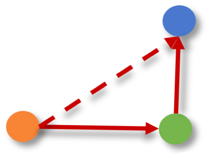

<h1 align="center">  InternEmbedding </h1>

## 🚀 Train InternEmbedding
### Train the embedder:
```shell
accelerate launch --config_file /path_to/accelerate_config.yaml run.py train \
    --init_backbone=internlm/internlm2-chat-1_8b \
    --pool_type=eos \
    --backbone_type=InternLM \
    --task_prompt \
    --embedding_norm \
    --task_adaptation \
    --sampler=indataset \
    --hard_negative_sampling \
    --hard_negative_num=1 \
    --warmup_rate=0.01 \
    --clip_gradient \
    --checkpoint_batch_size=25 \
    --gradcache_chunk_size=25 \
    --temperature=0.01 \
    --learning_rate=1e-5 \
    --save_ckpt_steps=200 \
    --matryoshka_adaptive_dims=2048 \
    --mytryoshka_size=2048 \
    --batch_size_per_gpu=1000 \
    --dataset_config=your_dataset_config \
    --embedder_name=your_logging_name

```
* Notes: config your wandb account with passwords, which is defaultly saved in */root/.netrc*:
```shell
machine api.wandb.ai
  login user
  password Your_API_Keys
```

### Custom Datasets:
* The training datasets are set by yaml format, whose architecture is as below:
```yaml
root_path: your_dataset_parent_path
internembedder_datasets:
  - name: your_dataset_name
    data_type: s2p # Support: [s2s, s2p, p2s, p2p], where s is sentence (short text) and p is passage (long text).
    task_type: Classification # Support: [Classification, Clustering, PairClassification, Retrieval, Preference, STS, Reranking]
    prompts: ["task definition or description"]
    sampling_ratio: 1.0 # range from 0.0 to 1.0
```
* Tips:
    *  The name of your custom dataset (**name**) must exist in your **root_path**, where has a file named *train.jsonl*.
    * Every sample in *train.jsonl* has two or three keys: **question**, **response** and **negative_response** (optional). The specific case shows as below:
    
    ```json
    {
        "question": "i didnt feel humiliated",
        "response": "sadness",
        "negative_response": [
            "love",
            "joy",
            "fear",
            "surprise",
            "anger"
        ]
    }
    ```

## 📐 Evaluate InternEmbedding
### Evaluate the embedder on MTEB:
```shell
python run.py evaluate \
--pool_type=eos \
--backbone_type=InternLM \
--embedder_ckpt_path=/path_to/your_saved_ckpt \
--embedder_name=your_logging_name \
--mteb_evaluation_tasks=Banking77Classification,EmotionClassification
```

## 🌏 Deploy InternEmbedding
### Deploy the embedder with OpenAI style (not support yet)
```shell
python run.py deploy \
--pool_type=eos \
--backbone_type=InternLM \
--embedder_ckpt_path=/path_to/your_saved_ckpt \
--embedder_name=your_logging_name
```